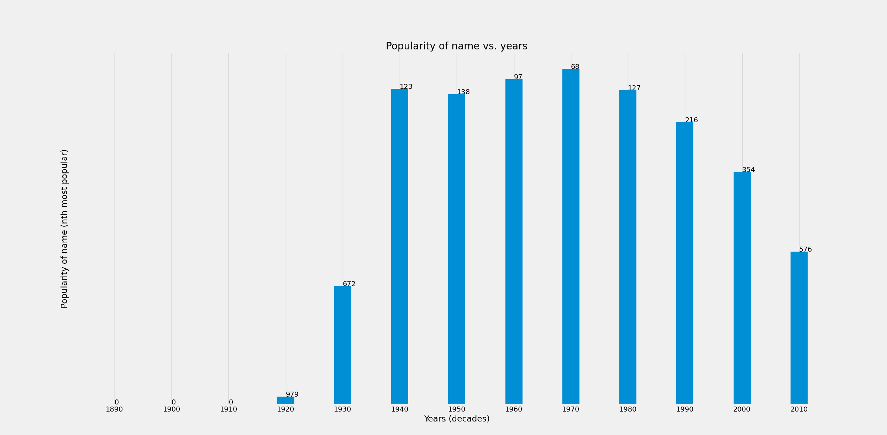
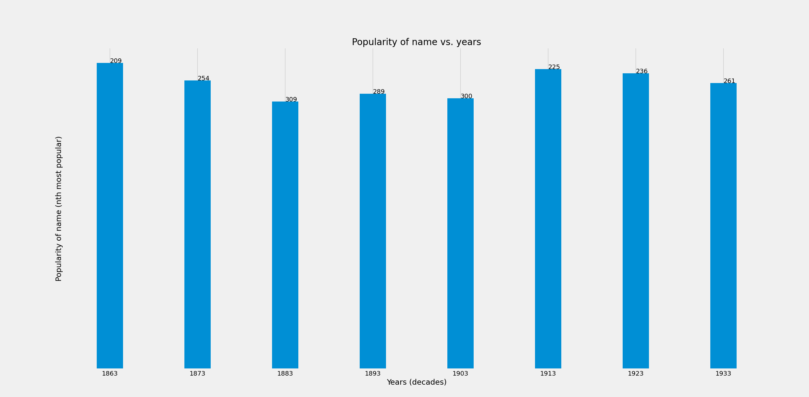

# LWNamePopularityVisualizer

[](https://opensource.org/licenses/MIT)


LWNamePopularityVisualizer visualizes the popularity of a certain name for each decade.


## Usage

```
$ python3 -m venv .venv
$ source .venv/bin/activate
$ pip3 install -r requirements.txt
$ python3 src/LWNamePopularityVisualizer.py include/names.txt


This program allows you to search through the
data from the Social Security Administration
to see how popular a particular name has been
since 1890.
Name: jon
Gender (M or F): m
Jon    M  0  0 0 979 672 123 138 	97  68  127 216 354 576

JON m Scandinavian, Basque Scandinavian and Basque form of JOHN; m English Short form of ATHAN
```

Which will generate the following plot:



The y-axis values represents how popular a given name was for each decade. For example, a
popularity of 1 (most popular) would mean that that name was the 1st most popular name for that decade.
A popularity of 1000 (least popular) would mean that that name was the 1000th most popular name for that
decade.

The default name popularity file is [`names.txt`](include/names.txt) with a start year of 1890. If
the name popularity file is set to [`names2.txt`](include/names2.txt), then the start year will be
1863.

If names2.txt had been provided, then:

```
$ python3 src/LWNamePopularityVisualizer.py include/names2.txt


This program allows you to search through the
data from the Social Security Administration
to see how popular a particular name has been
since 1863.
Name: myra
Gender (M or F): f
Myra   f 209  254 309 289 300  225  236 261

MYRA f English Created by the 17th-century poet Fulke Greville.
```



## Unit Tests

To run unit tests, run:
```
pytest
```


## Third-Party Software

- [Matplotlib](https://matplotlib.org/): Plotting and visualization library for Python.
- [pytest](https://docs.pytest.org/en/7.0.x/) (MIT license): Python unit testing framework.


## References and Acknowledgements

The name popularity information in [`names.txt`](include/names.txt) and [`names2.txt`](include/names2.txt)
is based on [data from the Social Security Administration](https://www.ssa.gov/OACT/babynames/).

The specifications for this project, along with `names.txt` and `names2.txt`, was provided on the
[UW Seattle CSE 142 summer 2017 website](https://courses.cs.washington.edu/courses/cse142/17su/homework.shtml).
The original assignment was meant to be written in Java, but I completed it using Python.

This project also includes a [Python class](src/HashSet.py) that provides a basic implementation
for a HashSet.

I would like to give credit to UW Seattle's autumn 2017 CSE 143 course for providing the basis for
this code. The original HashSet (written in Java) can be found on
[this page](https://courses.cs.washington.edu/courses/cse143/17au/lectures/HashSet.java);
I based my Python implementation on the Java implementation.
